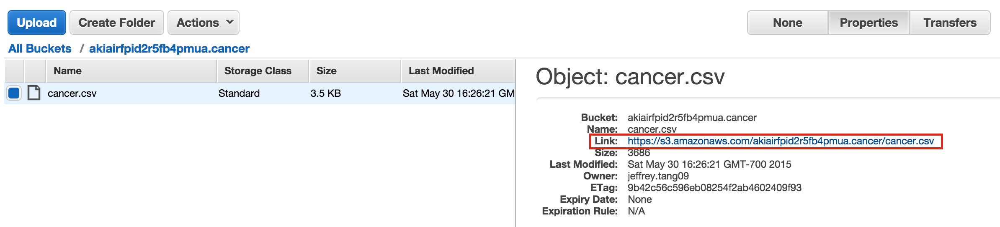

## Part 1: S3 on AWS

S3 is the storage system on AWS. Here, you will practice interacting with it via the Amazon GUI
and with the Python library `boto3`. You should know how to read and write files to S3 using a
python script at the end of this exercise.

<br>

1. Log into your [Amazon account](http://aws.amazon.com/console/), and create an S3 bucket using the GUI.
   **The bucket name must be globally unique (not used on any AWS account).**

   [Rules for S3 Bucket Names](http://docs.aws.amazon.com/AmazonS3/latest/dev/BucketRestrictions.html):
   * Bucket names must be at least 3 and no more than 63 characters long.
   * Bucket names can contain lowercase letters, numbers, and hyphens.
   * Periods are allowed but can cause problems. Avoid using periods.
   * Bucket names cannot start or end with a hyphen or period.


2. By default the bucket is private.  You can control the public permissions
   to it with the following:

   - Add **`Everyone`** as the grantee by clicking **`Add more permissions`**

   However, in general you will want to be very careful with giving `Everyone`
   any kind of access to your bucket. To give `Everyone` access to read from
   your bucket (but nothing else):

   - Click **`Add bucket policy`** and include the following (note you
   will need to do this to be able to follow along with this assignment):

     **Remember to change the bucket name**

     ```
     {
      "Version": "2008-10-17",
      "Statement": [
        {
           "Sid": "AllowPublicRead",
           "Effect": "Allow",
           "Principal": {
              "AWS": "*"
           },
           "Action": "s3:GetObject",
           "Resource": "arn:aws:s3:::<your bucket name>/*"
           }
      ]
     }
     ```

2. Upload (using the GUI) `data/cancer.csv` to your bucket, and note the link to the file.

   


3. Use `read_csv()` in `pandas` to read in the file from S3 (you can consider the S3 URL as a file path). Include the `chunksize` argument in `read_csv`
   to read in a subset of the file. In this case, with 301 rows, you would not need to subset your data.
   For larger datasets, this would become handy.

4. Compute the rates of cancer for each row, and make a histogram of the rates. Save the histogram as a `.png`
   file using `savefig` in matplotlib. Save a `.csv` file of the rates you use for the histogram as well.

5. Write a script using `boto3` to upload the histogram `.png` and the rates `.csv` to the bucket you have created.
   Confirm you have uploaded the files by checking the GUI console.


<br>

## Part 2: EC2 on AWS

EC2 is a remote virtual machine that runs programs much like your local machine. Here you will learn how to
run tasks on an EC2 machine. Most EC2 instances come without a lot of the packages you need. Here, we will use
an instance that has most of the data science packages installed.

<br>

1. Create an EC2 instance. Choose `t2.micro` for the instance type and Ubuntu 16.04 as the operating system. Give the instance a role that allows it full access to S3. Choose an *all-lowercase* name for the instance and add a `Name` tag (Key=`Name`, Value=`example`). Careful: Do not replace `Name` in the key field. Set the value instead.
  
2. Add the instance to your `~/.ssh/config` file, but replace `example` with the actual name.

```
Host example
 HostName 52.27.155.84
 User ubuntu
 IdentityFile ~/.ssh/example.pem
```
3. Log into the instance you have launched using `ssh`. 

4. Update `apt` sources and perform routine updates:

```
sudo apt update
sudo apt upgrade
```

5. Install Anaconda

```
# Download Anaconda3
wget -S -T 10 -t 5 https://repo.continuum.io/archive/Anaconda3-5.0.1-Linux-x86_64.sh -O $HOME/anaconda/anaconda.sh

# Install Anaconda
bash $HOME/anaconda/anaconda.sh -u -b -p $HOME/anaconda

# Add Anaconda to current session's PATH
export PATH=$HOME/anaconda/bin:$PATH

# Add Anaconda to PATH for future sessions via .bashrc
echo -e "\n\n# Anaconda" >> $HOME/.bashrc
echo "export PATH=$HOME/anaconda/bin:$PATH" >> $HOME/.bashrc
```

6. Install required AWS libraries

```
pip install awscli boto3
```


7. Refer to the script you have written to process `cancer.csv` in `Part 1`. Instead of writing the results to
   the same S3 bucket as where `cancer.csv` is, change the script to write to a new bucket.
   Use `scp` to copy the script onto the EC2 instance.

8. Run the script on the EC2 instance and check S3 to make sure the results are transferred to a new bucket. In practice, you will be testing the script locally with a smaller subset of the data, and run the script on the whole set on EC2. If your task requires more processing power, you have the option to run it on a more powerful EC2 instance with more RAM and more cores.
