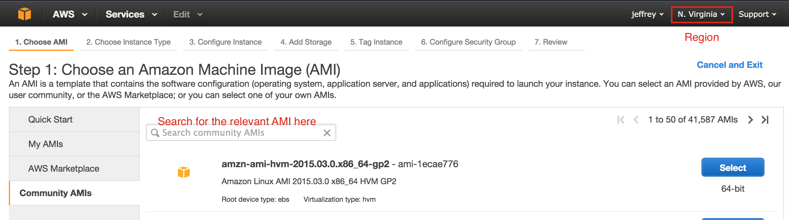

## Part 1: S3 on AWS

S3 is the storage system on AWS. Here, you will practice interacting with it via the Amazon GUI
and with the Python library `boto`. You should know how to read and write files to S3 using a
python script at the end of this exercise.

<br>

1. Log into your [Amazon account](http://aws.amazon.com/console/), and create an S3 bucket using the GUI.
   **The bucket name must be:**

   - Unique (no one has ever used it).
   - Lower cased
   - No underscore
   - No period (although periods are allowed, ```boto``` has a bug that doesn't allow
                working with them)

   By default the bucket is private.  You can control the public permissions
   to it with the following:

   - Add **`Everyone`** as the grantee by clicking **`Add more permissions`**

   However, in general you will want to be very careful with giving `Everyone`
   any kind of access to your bucket. To give `Everyone` access to read from
   your bucket (but nothing else):

   - Click **`Add bucket policy`** and include the following (note you
   will need to do this to be able to follow along with this assignment):

     **Remember to change the bucket name**

     ```
     {
      "Version": "2008-10-17",
      "Statement": [
        {
           "Sid": "AllowPublicRead",
           "Effect": "Allow",
           "Principal": {
              "AWS": "*"
           },
           "Action": "s3:GetObject",
           "Resource": "arn:aws:s3:::<your bucket name>/*"
           }
      ]
     }
     ```

2. Upload (using the GUI) `data/cancer.csv` to your bucket, and note the link to the file.

   


3. Use `read_csv()` in `pandas` to read in the file from S3 (you can consider the S3 URL as a file path). Include the `chunksize` argument in `read_csv`
   to read in a subset of the file. In this case, with 301 rows, you would not need to subset your data.
   For larger datasets, this would become handy.

4. Compute the rates of cancer for each row, and make a histogram of the rates. Save the histogram as a `.png`
   file using `savefig` in matplotlib. Save a `.csv` file of the rates you use for the histogram as well.

5. Write a script using `boto` to upload the histogram `.png` and the rates `.csv` to the bucket you have created.
   Confirm you have uploaded the files by checking the GUI console.

   **Hint: See [`src/boto_reference.py`](src/boto_reference.py)**
   **Hint: See [`read_aws_credentials.md`](read_aws_credentials.md)**

<br>

## Part 2: EC2 on AWS

EC2 is a remote virtual machine that runs programs much like your local machine. Here you will learn how to
run tasks on an EC2 machine. Most EC2 instances come without a lot of the packages you need. Here, we will use
an instance that has most of the data science packages installed.

<br>

1. **Launch** the data science EC2 using the AMI shown below. Remember to pick a keypair which
   you have the `.pem` file for. Wait for the `Status Checks` to be completed before moving on.

   ```
   US East (Northern Virginia)	   ami-6534390f
   ```

   

2. Log into the instance you have launched using `ssh`. The user name is `ubuntu` if you've chosen an `ubuntu` instance
   (see here for [login help](http://docs.aws.amazon.com/AWSEC2/latest/UserGuide/AccessingInstancesLinux.html)). Remember to change the permissions on your `.pem` file if you have not already. Do not store your .pem file in the repo for this day (or add it to your .gitignore if you do) - just make sure __NOT__ to push it up to github.

   `chmod 600 keypair.pem`

3. Refer to the script you have written to process `cancer.csv` in `Part 1`. Instead of writing the results to
   the same S3 bucket as where `cancer.csv` is, change the script to write to a new bucket.
   Use `scp` to copy the script onto the EC2 instance.

4. Run the script on the EC2 instance and check S3 to make sure the results are transferred to a new bucket. In practice, you will be testing the script locally with a smaller subset of the data, and run the script on the whole set on EC2. You would also run it on a more powerful EC2 instance with more RAM and more cores.
