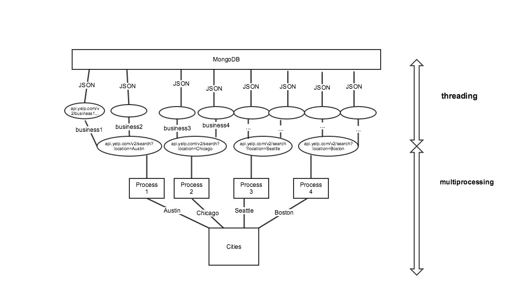

## Part 1: Parallelization via multiprocessing

To run a program in parallel, we can leverage the multiple CPU cores on the machine. The
[`multiprocessing`](https://docs.python.org/2/library/multiprocessing.html) library in
Python allows parallelization of one task across multiple cores by forking a parent
process into multiple child processes.

1. Look at the `primes_sequential` function in [`src/primes.py`](src/primes.py). The function finds prime
   numbers between `100000000` and `101000000` by iterating through the list of numbers one-by-one and checking
   their primality. Run the script and note how long it takes to execute.

2. The function can be parallelized by splitting the list into smaller chunks of numbers and executing the function on the each of the chunks respectively. For example:

    ```python
    import multiprocessing

    def some_function(lst):
       #code ...

    pool = multiprocessing.Pool(processes=number_of_processes)
    outputs = pool.map(func=some_function, iterable)
    ```

    The `map` method on the pool will use multiple processes on multiple cores
    to apply the function passed into pool.map to each element in the iterable  passed into pool.map. The results will come back as a list, where each element in the list is the output of the function applied to an element in the iterable.

3. Implement `primes_parallel` using a pool size of 4 (or the number of cores on your machine), run it, and note the run time of the script. There should be some improvement in speed compared to running the ```primes_sequential``` function that you ran earlier.

    Note to find out the number of cores the multiprocessing library has available to use, you can do the following:

    ```python
    import multiprocessing
    multiprocessing.cpu_count()
    ```

4. Run the script again. This time run the following unix command in a separate terminal to see the parallel processes running.

    ```shell
    ps aux | grep primes.py
    ```

5. How many processes were running at a time. Does that match the number of processes you have initiated?


## Part 2: Concurrency via threading

Concurrency is where we have one process executing two or more tasks. Concurrency is achieved by initiating multiple threads within our single process; we assign a single task to each thread so that we run several tasks in parallel.  Here we are going to use the [`threading`](https://docs.python.org/2/library/threading.html) module in Python to initiate threads within a process. Note that this is just one option for implementing threads in python, and that there are others you may read about.

A common use case for threads is web scraping / making web API calls. We will implement concurrent web-scrapping where each web request will have its own thread. This allows the next API call(s) to start on a different thread while waiting for the other ones to respond back.

1. Examine and run the `request_item` function in [`src/request_example.py`](src/request_example.py). Provide an `item_id` of `13` and examine the content of the response. The function makes a call to get the metadata of an article on HackerNews with a particular `item_id`.


2. Fill in the function `request_sequential` in such a way that would get the metadata of all posts with an `item_id` ranging from `1` to `20`.

3. Fill in the function `request_concurrent` in such a way that each web call is made in a separate thread.

    Below is an example of starting a single thread.

    ```python
    def target_function(arg1, arg2):
        #code ...

    t = threading.Thread(target=target_function, args=(arg1, arg2))
    t.start()
    ```

    With multiple threads, you will need to initiate them using a for loop and append the threads to a list before calling `start` on the thread. After the first loop, you will need another loop to loop through the list of threads and call `join` on each of them to ensure the final result is returned after all threads are terminated.

4. To track the concurrent execution of the threads, modify the `request_item` function to print out the name of the current thread before and after the `get` request. Use the following code to get name of the current thread.

    ```python
    threading.currentThread().getName()
    ```

5. Run `request_sequential` and `request_concurrent` and compare the run time.

<br>


## Part 3: Parallelism and Concurrency

Taking what we have done in `Part 1` and `Part 2`, we are going to **combine parallelism and concurrency** to scrape Yelp business metadata. That means we are going to run our program on **multiple processes using multiple threads in each process**.

- **Each process takes 1 city** and scrapes the business ids
- **Each thread within a process** takes a business id and scrapes its metadata



<br>

1. Take a look at [Yelp's API documentation](https://www.yelp.com/developers/documentation/v3) and get your authentication set up by [generating new client id/secret](https://www.yelp.com/developers/v3/manage_app) if you have not already.

   We are going to use the [search](https://www.yelp.com/developers/documentation/v3/business_search) (for searching based on city names) and [business](https://www.yelp.com/developers/documentation/v3/business) (to look up business info by ids that we retrieved from search). _Do not worry too much about the details of the API, there is starter code for it_.

2.  Change the API credentials in [`yelp_api_key.yaml`](src/yelp_api_key.yaml) to what you have got in `1`. **Add this file to `.gitignore` to protect your keys from being uploaded to GitHub**. Never include API keys in your code!

3. Read the function `scrape_sequential` in [`src/yelp.py`](src/yelp.py). It calls `city_search()` to get 20 business ids for each city. Then it calls `business_info()` on each business id to get the business metadata. Finally the metadata is inserted into MongoDB.

    Run `src/yelp.py` and note how long it takes to complete.

4. To apply principles of parallelism and concurrency to the `scrape_sequential` function, fill in the function `scrape_parallel_concurrent` which calls the functions `city_search_parallel` and `business_info_concurrent`. Use `scrape_sequential` and related functions as a template.

    Below are some instructions if you need some help:

    In `scrape_parallel_concurrent`:

    - Open the file containing the cities
    - Make a process pool and map the `city_search_parallel()` to the cities (this will initiate multiple processes to get the city level data)
    - Within each city level process, multiple threads will be made to get the business metadata

    In `city_search_parallel`:

    - Accept the name of the city, call the search API, and return a json response
    - Call `business_info_concurrent()` and pass the json response to it

    In `business_info_concurrent`:

    - Retrieve the business ids from the json response
    - Loop through the ids and for each id, make a thread calling the business API
    - Insert the response of the business call into MongoDB
