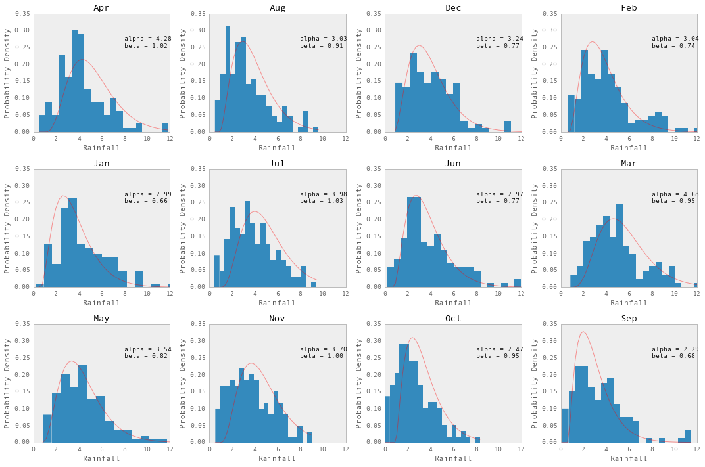
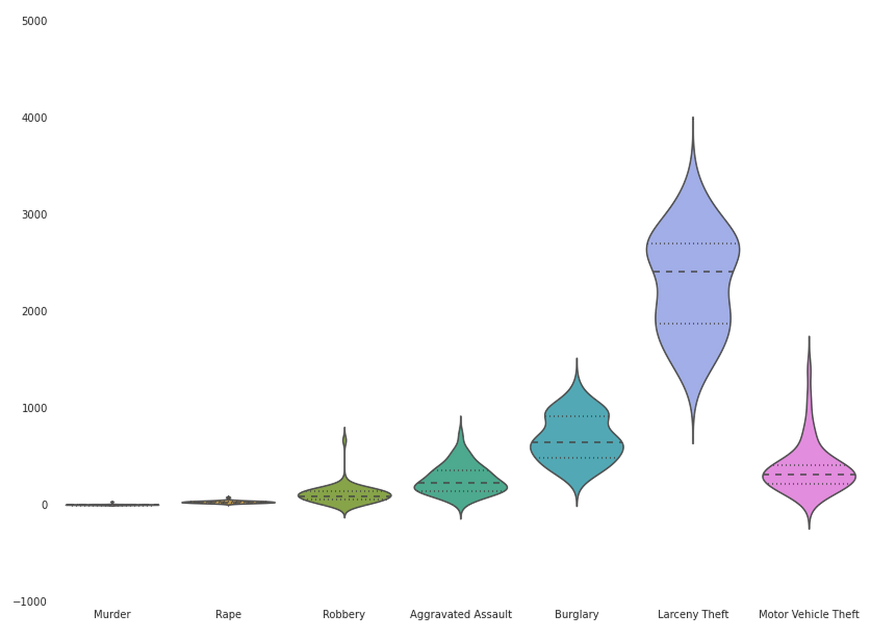

## Plotting and Exploratory Data Analysis

Plotting is an important step of any data project, and will likely be a daily
activity in this course. Often, an early step in your analysis will be to
visualize a dataset, with an eye towards summary statistics and/or the
underlying distribution of your data.

We will cover fancier data visualization later in the course, but today is about
quickly generating plots that help you understand data, whether it's a new
dataset you've been handed or some aspect of a model you've built.

The main plotting library we'll use in Python is matplotlib, which integrates
nicely with pandas. 

## Goals

* Understand how figures, subplots, axes work together in matplotlib, and pandas.
* Use plots and subplots effectively to explore a dataset.
* Distinguish between different categories on the same plot.
* Plot inside and outside of ipython notebooks.

### Morning:
- Exercise: [pair_pandas.md](pair_pandas.md)

### Afternoon:
- Exercise: [pair_plotting.md](pair_plotting.md)
