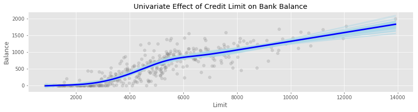
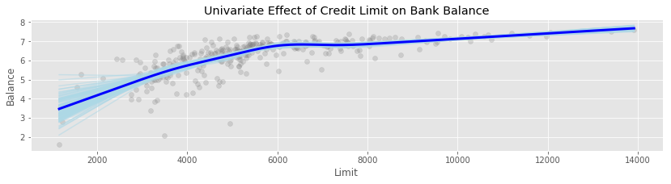
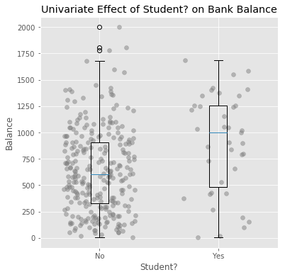

# Linear Regression Sprint

In this morning and afternoon sprint, you will be constructing a detailed linear regression to predict the credit card balance of a bank customer.

## Linear Regression Problem

This afternoon we will work through a linear regression problem from start to finish. 

You are given a dataset that contains information about 400 individuals' credit card and bank balances.
Your task is to predict an individual's balance based on various variables.
 
### Setup

1.  Setup your environment so that you can import the modules in the `src` directory.  These wull be useful throughout the assignement.  For examples of how to use them, you can consult the lecture notebook [here](https://github.com/gSchool/DSI_Lectures/blob/master/linear-regression/matt_drury/linear-regression-morning-lecture.ipynb). 

### EDA: Scatter Matrix

2. Load the data into a dataframe from `data/balance.csv`. Make a scatter matrix of the variables. Take notes on the types of variables, and their distribution.

3. Make note of any strongly correlated variables, or any patterns between two predictor variables.  Discuss with your partner any possible consequences of using highly correlated variables in the model.

### EDA: Continuous Predictors

4. Create some univariate plots of the numerical features, and overlay a spline on each to get a view for how the balance varies with respect to each of those features.  Make notes of anything unusual.

5. You should have noticed that there are a large number of records with a zero balance, and these seem to not follow the same patterns as the rest of your data.  Discuss with your partner the merits of keeping or removing those records from the data set.  How would doing so change the problem we are trying to solve?  Does it make sense to try to predict these zero balance records with a linear regression model?  If you did want to model them, are there any approaches you have heard of that may be useful (even from outside of class)?



If you get stuck, here is the code I used to create the image above:

```
fig, ax = plt.subplots(figsize=(14, 3))

plot_univariate_smooth(
    ax, 
    balance["Limit"].values.reshape(-1, 1),
    balance['Balance'],
    bootstrap=100)

ax.set_title("Univariate Effect of Credit Limit on Bank Balance")
ax.set_ylabel("Balance")
ax.set_xlabel("Limit")
```

6. Remove the records with zero balance from the dataset, and recreate the splines from before.  Do the scatter plots look evenly spaced around the splines?

7. Create univariate plots of the continuous variables against the logarithm of `y`.  The resulting scatterplot should look better spaced around the fit splines.  This is good, as it allows our regression to attempt to fit each data point just as closely as any other (a.k.a heteroskedacity).  We will fit our regression model to the logarithm of `y` instead of `y` itself.



8.  Using the information in the univariate plots, create feature transformation pipelines for each of the continuous predictors.  

### EDA: Categorical Predictors

9. There are three binary (two-valued) predictors in the dataset: `Gender`, `Student`, and `Married`.  Using the `MapFeature` transformer, create a pipeline to create an indicator variable for each of these features.  The indicator variable should take on the values `0` or `1` (for example, the `Student` indicator variable may take value `0` for `No`, and `1` for `Yes`).

10. There is one other feature in the dataset, `Ethnicity`. Discuss with your partner the implications of using it in your regression model.  Are there any circumstances where you absolutely should *not* use it?  Are there any where it is ok?

11. If you decided to use `Ethnicity` in your model, create indicators for the levels of the variable you would like to use as predictors.

12. Create univariate plots for your categorical variables.  Which variables have levels that create clear differences in the value of `Balance`?  Which do not?

Note: Here is an example of a plot you could build for a categorical predictor:



I would really like you to try to write some code to create a plot like this on your own, as it will be a good coding challenge.  If you need a head start, take a peek inside the `catagorical_plot.py` file for the code I used to create the above image.  When you've got it working, wrap the result in a function so you can use it multiple times.


### Regression

11. Use the `FeatureUnion` class to construct a feature generation pipeline for a linear regression to predict `Balance`.  Use the `transform` method to create a new dataframe with your new features.

12. Using all the feature variables, fit a linear regression model to predict `Balance`.  Print out the coefficients from the resulting model.

13. To get a feel for how the coefficients vary, i.e. how accurately they have been estimated, fit your model to `1000` bootstrap samples from the training data, and plot the histograms of the resulting parameter estimates.  Based on these histograms, are there any predictors you would like to remove from the model?  If yes, feel free to do so and refit.


### Visualization and Exploration of the Model

14. Create predicted vs. actuals by variable plots.  You should hopefully see that the mean predicted values trend through the center of the scatterplots.  What do these plots mean for the categorical variables in your model?  Does it look like these fit well?

15. Create residual plots by the variables in your model.  Do any of them show deficiencies in how the variables have been fit?  If so, feel free to go back and refit the model with a different feature transformation.  It may also be interesting to purposefully miss-specify the fit of a feature, so as to see what can go wrong.

16. Create a residual by predicted value plot.  Does everything look good here?  Are there any range of predictions for which the model is predicting poorly?

17. Create partial dependency plots for each of the predictors.  Do any of these surprise you?  Are there any instances where the fit of a feature in the multi-variable model is *not* the same as the fit of the feature in a one-variable model?  What tends to cause that to happen?


### Model Fit Measurement

18. Measure the sum of squared residuals for your model.  How would you expect this to change as you added more knots to your splines?  As you removed knots or predictors?  Discuss with your partner.

19. Lookup the definition of the `R^2` statistic.  Compute it for your model.

20. Use boostrapping to assess the variance of your R^2 statistic.

### Assumptions and Inference

If you would like to use the p-values from regression to test any hypotheses, you will have to check two additional assumptions: heteroskedacity, and normal distribution of errors.

21. Go back to your residuals plots and look them over for violations of heteroscedacity.  Are there any obvious problems?  Thought experiment: what would have happened if we had **not** log transformed our predictors up front.  If you have the time, fit this model and look at the residual plots.

22. Make a [normal qq plot](https://en.wikipedia.org/wiki/Q%E2%80%93Q_plot) of the residuals of the model.  You can use this to visually inspect for violations of the normal assumption.  You may find the following starter code useful:

```
def qq_plot(ax, actual):
    base = scs.norm(0,1)
    actual = sorted(actual)
    theoretical = base.ppf(np.arange(len(actual))/float(len(actual)))
    ax.plot(theoretical, actual, '.')
```

23. Test the hypothesis that students and non-students hold significantly different bank balances, all else being equal.  To set a rejection threshold, come up with situations where a very stringent (0.01), or a very flexible (0.1) threshold would be justified.  How would you communicate your findings to the bank stakeholders in each of these cases?
